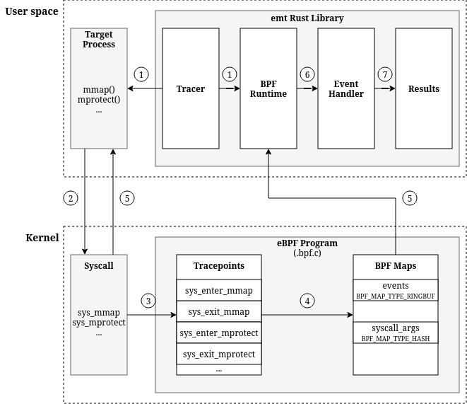

# Architecture

High-level overview of interactions between the target process, in-kernel eBPF probes, and the Rust tracer.

## Overview



### 1. Start tracer on target PID, then load BPF object and attach probes.

The tracer validates the target PID existence using `kill(pid, 0)`. Once started, the system monitors all `mmap/mprotect` syscalls for the specific process in the eBPF program.

```rust
// Create a tracer for a target process (PID)
let mut tracer = Tracer::new(target_pid);
tracer.start()?;
```

### 2. Target process calls syscalls like `mmap/mprotect`.

[Here](https://stackoverflow.com/questions/28015876/what-do-i-have-to-do-to-execute-code-in-data-areas-segment-protection) is an example, which allocates writable memory, writes machine code, marks that memory executable, and then calls it.

```c
#include <stdio.h>
#include <stdint.h>
#include <unistd.h>
#include <string.h>
#include <sys/mman.h>   /* mmap(), mprotect() */

static uint8_t code[] = {
    0xB8,0x2A,0x00,0x00,0x00,   /* mov  eax,0x2a    */
    0xC3,                       /* ret              */
};

int main(void)
{
    const size_t len = sizeof(code);

    /* mmap a region for our code */
    void *p = mmap(NULL, len, PROT_READ|PROT_WRITE,  /* No PROT_EXEC */
            MAP_PRIVATE|MAP_ANONYMOUS, -1, 0);
    if (p==MAP_FAILED) {
        fprintf(stderr, "mmap() failed\n");
        return 2;
    }

    /* Copy it in (still not executable) */
    memcpy(p, code, len);

    /* Now make it execute-only */
    if (mprotect(p, len, PROT_EXEC) < 0) {
        fprintf(stderr, "mprotect failed to mark exec-only\n");
        return 2;
    }

    /* Go! */
    int (*func)(void) = p;
    printf("(dynamic) code returned %d\n", func());

    pause();
    return 0;
}
```

### 3 Capture syscall args and returns.

See the source code [memory_tracer.bpf.c](../src/bpf/memory_tracer.bpf.c) and its technical documentation [ebpf.md](ebpf.md).

The kernel component attaches to tracepoints: `sys_enter_mmap`, `sys_exit_mmap`, `sys_enter_munmap`, `sys_enter_mprotect`, and `sys_exit_mprotect`. This dual-phase approach captures complete syscall context including arguments at entry and return values at exit.

### 4. Dump memory page by page at BPF side, and send structured events to userspace via ringbuf map.

```c
// ...
bpf_repeat(num_pages) {
    struct memory_event *event = bpf_ringbuf_reserve(&events, sizeof(*event), 0);

    event->addr = cur_addr;
    event->length = ONE_PAGE_SIZE;
    event->pid = pid;
    event->event_type = event_type;
    event->timestamp = bpf_ktime_get_ns();

    long ret = bpf_probe_read_user(event->content, ONE_PAGE_SIZE, cur_data);

    if (ret == 0) {
        event->content_size = ONE_PAGE_SIZE;
    } else {
        event->content_size = 0;
    }

    bpf_ringbuf_submit(event, 0);
    // ...
}
```

### 5. Parse received events and get memory pages.

The [EventHandler](../src/event_handler.rs) receives raw events from bpf side and transforms them into structured [Page](../src/models.rs) objects. As below, each page contains the virtual address, size, timestamp, and dumped memory content if possible.

```rust
pub struct Page {
    pub addr: usize,
    pub size: usize,
    pub timestamp: String,
    pub source_file: Option<PathBuf>,
    pub content: Option<Vec<u8>>,
}
```

<a href="#top">Back to top</a>
