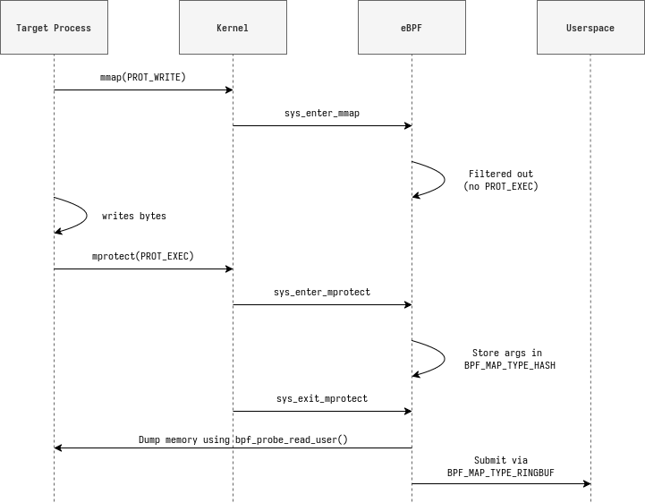

# eBPF Internals

Deep dive into [memory_tracer.bpf.c](../src/bpf/memory_tracer.bpf.c)

## Overview



What can we do with this BPF program:

- Capture syscalls and retrieve their arguments and return values.
- Filter syscalls based on PID and protection flags.
- Dump memory from the target process at target address.
- Send structured memory page by page to userspace.

## Structure

```bash
src/bpf/
├── memory_tracer.bpf.c   # Main BPF program
└── vmlinux.h             # Auto‑generated BTF header
```

## Map Definations

| Map Name        | Type                 | Purpose                       |
| --------------- | -------------------- | ----------------------------- |
| `events`        | BPF_MAP_TYPE_RINGBUF | Event transport to user space |
| `mmap_args`     | BPF_MAP_TYPE_HASH    | Temporary mmap arguments      |
| `mprotect_args` | BPF_MAP_TYPE_HASH    | Temporary mprotect arguments  |

```rust
// Ring buffer map for transferring data to userspace
struct {
    __uint(type, BPF_MAP_TYPE_RINGBUF);
    __uint(max_entries, RINGBUF_SIZE);
} events SEC(".maps");

// Argument storage maps
struct {
    __uint(type, BPF_MAP_TYPE_HASH);
    __uint(max_entries, 10240);
    __type(key, __u64);
    __type(value, struct mmap_args_t);
} mmap_args SEC(".maps");

struct {
    __uint(type, BPF_MAP_TYPE_HASH);
    __uint(max_entries, 10240);
    __type(key, __u64);
    __type(value, struct mprotect_args_t);
} mprotect_args SEC(".maps");
```

## CO‑RE

This project uses BPF CO-RE (Compile Once, Run Everywhere), which requires a vmlinux.h file generated from your system’s kernel BTF data. If src/bpf/vmlinux.h does not exist, the script build.rs will automatically generate it by running:

```bash
bpftool btf dump file /sys/kernel/btf/vmlinux format c > src/bpf/vmlinux.h
```

## Helpers Used

| Helper                     | Purpose                             |
| -------------------------- | ----------------------------------- |
| `bpf_get_current_pid_tgid` | Identify caller thread (TID \| PID) |
| `bpf_map_update_elem`      | Store per-thread syscall arguments  |
| `bpf_map_lookup_elem`      | Retrieve stored args for exit path  |
| `bpf_map_delete_elem`      | Clean up arg cache on error/exit    |
| `bpf_ringbuf_reserve`      | Allocate space in ring buffer       |
| `bpf_ringbuf_submit`       | Published event to userspace        |
| `bpf_ktime_get_ns`         | Timestamp since boot                |
| `bpf_probe_read_user`      | Copy userspace memory               |
| `bpf_repeat`               | Loop execution for specified times  |

## Building

```bash
clang -g -O2 -target bpf -c memory_tracer.bpf.c
```

## Debugging

### Insert debug prints `bpf_printk()`

```c
SEC("tracepoint/syscalls/sys_enter_mprotect")
int enter_mprotect(struct trace_event_raw_sys_enter *ctx) {
    u64 prot = ctx->args[2];

    // Debug print (visible in trace_pipe)
    bpf_printk("PROT: 0x%llx | PID: %d", prot, bpf_get_current_pid_tgid() >> 32);

    return 0;
}
```

### Enabling trace events

- Disable: 0
- Enable: 1

```bash
# Enable specific event
echo 1 | sudo tee /sys/kernel/debug/tracing/events/syscalls/sys_enter_mprotect/enable

# Enable all syscalls (noisy!)
echo 1 | sudo tee /sys/kernel/debug/tracing/events/syscalls/enable
```

### Reading debug output from `trace_pipe`:

```bash
sudo cat /sys/kernel/debug/tracing/trace_pipe

# Example output:
firefox-2303    [006] ...21 112636.673779: bpf_trace_printk: PROT: 0x5 | PID: 2303
```

> Reference
> https://www.kernel.org/doc/html/latest/trace/ftrace.html#trace-pipe

<a href="#top">Back to top</a>
